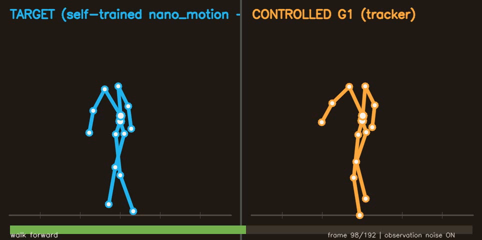
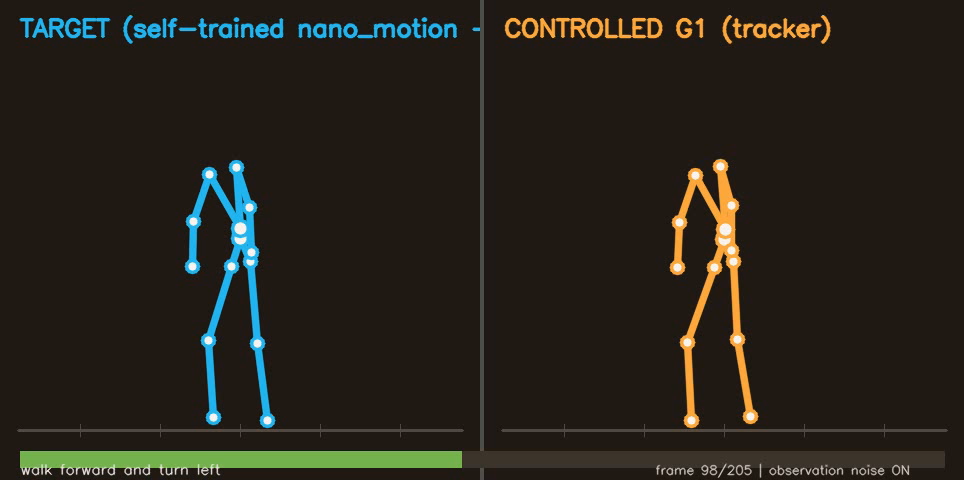
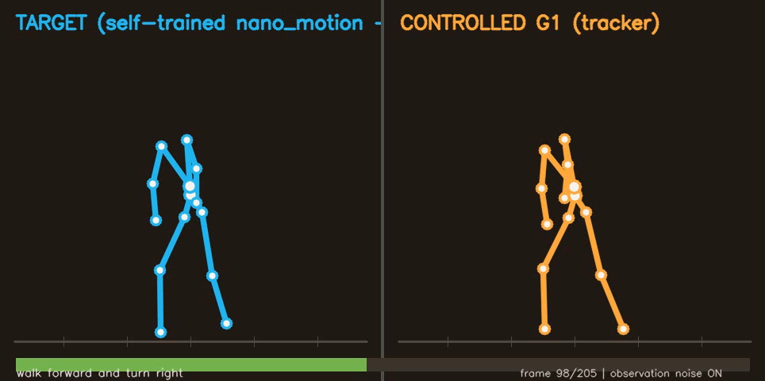

# Self-trained `nano_motion` + Motion Cerebellum

This project extends [`projects/text2motion_cerebellum`](../text2motion_cerebellum/)
by replacing the pretrained OMG generator with a NanoInfra `nano_motion` model
trained through the MotionHub/HumanML3D route:

```text
text -> self-trained nano_motion -> rot139 -> SMPL-H -> GMR IK
     -> G1 reference -> frozen motion_tracking policy -> simulated G1
```

It demonstrates that the complete interface works with a locally trained
Text2Motion "brain". It is not an OMG-parity claim.

BONES-SEED supplies the motion-codec and tracker training domains, but the
released exemplar does not pair its captures with captions. Text supervision for
this Text2Motion model therefore comes from the captioned MotionHub/HumanML3D
route; the two data roles are kept separate throughout the report.

## What was added

- MotionHub/HumanML3D cache preparation and fixed-checkpoint evaluation under
  [`projects/nano_motion_motionhub`](../nano_motion_motionhub/).
- A convention-isolated `rot139 -> SMPL-H -> G1` adapter using pinned GMR and the
  upstream `motion_tracking` physical gates.
- A mirrored semantic gate that requires body yaw and travelled path to agree on
  left versus right turns.
- A tracker-independent physical-margin selector. Among semantic-passing
  candidates it minimizes the worst normalized joint-speed, foot-slide, or hover
  gate ratio; tracker rollouts never rank candidates.
- Noisy closed-loop evaluation across three independently trained tracker policies,
  plus qualitative side-by-side target/G1 videos.

## Reference repair

The initial highest-semantic-score left turn passed every upstream physical gate
but completed only 44.7% of its first frozen-tracker smoke. This motivated one
explicitly post-hoc revision: generate 256 fixed left-turn seeds, retain the 37
passing the unchanged semantic gate, retarget all of them, and apply the frozen
physical-margin rule. Thirty-five passed the G1 gates; seed 16 was selected.

The selected reference keeps an 84.5 degree left turn while reducing the source
path from 2.12 m to 0.42 m. Its pre-tracker values are `foot_slide=3.80`,
`hover=14.28`, and maximum joint speed `5.28 rad/s`. The new one-policy smoke
completed all three prompts.

## Formal result

The formal protocol freezes the references, enables observation noise, and runs
three independently trained tracker policies with four repeats per prompt: 36
episodes in total.

| metric | self-trained nano_motion | prior nano_motion demo | OMG baseline |
| --- | ---: | ---: | ---: |
| success | **30/36 (83.3%)** | 34/36 (94.4%) | 34/36 (94.4%) |
| completion | 97.6% | 99.6% | 99.7% |
| MPJPE | 49.2 mm | 45.8 mm | 28.5 mm |
| foot sliding | 6.95 | 6.71 | 4.75 |
| jerk | 5.86 | 5.20 | 4.47 |

Per tracker-training seed, success was 100%, 58.3%, and 91.7%. A post-hoc
16-repeat diagnostic for tracker seed 1 remained low at 64.6% (left 43.8%, right
56.3%), so the gap is not explained by one unlucky four-repeat sample. The same
tracker seed is strong on the OMG and earlier nano references; the remaining issue
is an interaction between self-generated reference distribution and tracker seed.

The compact source report is
[`results/self_trained_v2.json`](results/self_trained_v2.json); the unchanged
formal episode aggregation is
[`results/self_trained_full_tracking.json`](results/self_trained_full_tracking.json).

## Demo

The videos use tracker policy seed 0, chosen because it passed the frozen smoke.
They are qualitative views; the table above always reports all three policies.

| forward | left | right |
| --- | --- | --- |
| [](assets/demo/self_motion_nano-motion-self-forward.mp4) | [](assets/demo/self_motion_nano-motion-self-left.mp4) | [](assets/demo/self_motion_nano-motion-self-right.mp4) |

## Reproducing the code path

1. Prepare the captioned caches and train `exemplars.nano_motion` as documented in
   [`../nano_motion_motionhub/README.md`](../nano_motion_motionhub/README.md).
2. Generate fixed seed ranges with `generate_seed_sweep.py`; apply
   `analyze_seed_sweep.py` for forward and `analyze_turn_sweep_v3.py` for turns.
3. Convert a rot139 candidate with `rot139_to_smpl.py`, then run
   `retarget_smpl_to_g1.py` from a pinned GMR/`motion_tracking` environment.
4. Apply `select_physical_margin.py`, assemble the three references with
   `assemble_refs.py`, and evaluate frozen tracker policies.
5. Aggregate episodes with `summarize_tracking.py` and reproduce the comparison
   with `compare_self_trained_v2.py`.

All utilities expose `--help`. Runtime-dependent GMR/MuJoCo evaluation remains in
the external tracker environment; dependency-light selectors and report builders
run locally.

## Data and license boundary

See [`DATA_AND_LICENSES.md`](DATA_AND_LICENSES.md). This change does not distribute
raw BONES-SEED/MotionHub/AMASS/HumanML3D data, derived reference shards, SMPL
assets, codec weights, Text2Motion checkpoints, tracker policies, or raw logs.
