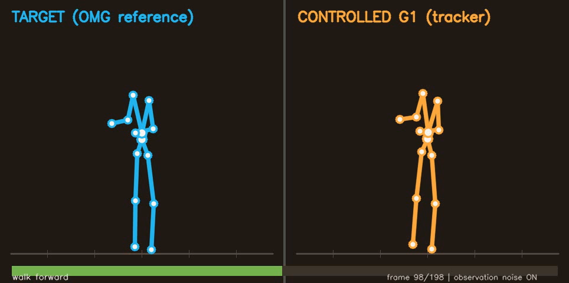
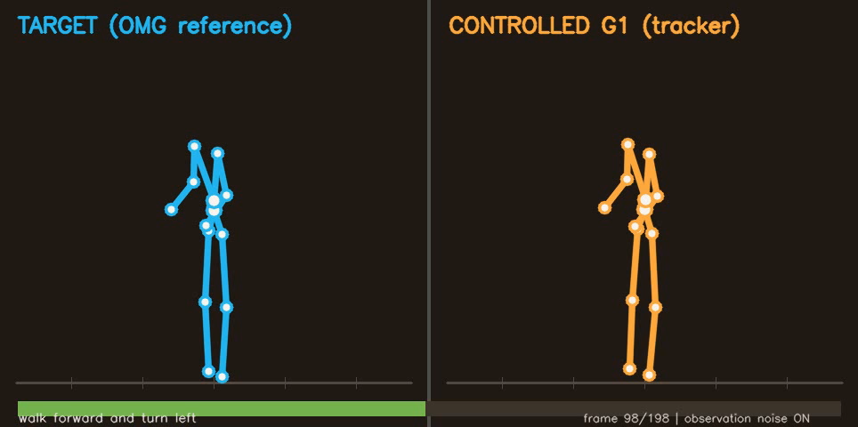
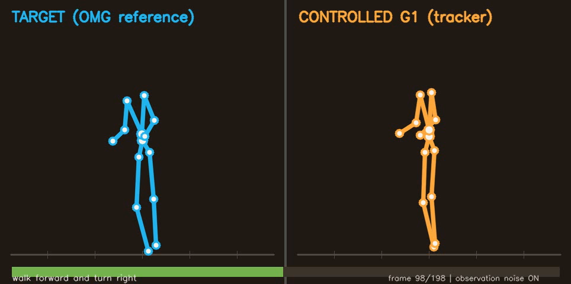

# Text2Motion → Motion Cerebellum bridge

This is the repository entry point for the final project. Start with
[`RESULTS.md`](RESULTS.md) for the pinned claims and one-minute verification,
[`FINAL_REPORT_CN.md`](FINAL_REPORT_CN.md) for the full Chinese report, and
[`DATA_AND_LICENSES.md`](DATA_AND_LICENSES.md) for the external artifact and
license boundary. [`SUBMISSION.md`](SUBMISSION.md) defines the intended Git
change set; raw data, checkpoints, full render sets, and provider logs are not
part of it.

This directory contains the minimum data bridge for the demo:

```text
text prompt → pretrained OMG 50M → G1 qpos_36 at ~30 Hz
            → omg_adapter → motion_tracking ref at 50 Hz
            → pretrained/trained G1 motion tracker → simulated robot
```

OMG and `suning-git/motion_tracking` already share the same Unitree G1 state
contract: root position, scalar-first root quaternion, and the same 29 joints in
the same order. The adapter therefore does **not** retarget through SMPL. It:

1. validates the `qpos_36` array and any supplied joint-name metadata;
2. normalizes quaternions and removes harmless sign flips;
3. resamples translation/joints linearly and orientation with SLERP to 50 Hz;
4. computes MuJoCo `qvel_35` exactly as the original repository does;
5. obtains left/right foot body positions from the target G1 MJCF;
6. writes the original `shard_*.npz` object-array reference format.

## Visual demo

The repository includes three side-by-side renders from the preferred
clean-start seed-0 checkpoint. The blue skeleton is the OMG target and the orange
skeleton is the closed-loop G1 tracker rollout. Click a poster to open the video:

| Walk forward | Turn left | Turn right |
|---|---|---|
| [](assets/demo/walk-forward.mp4) | [](assets/demo/turn-left.mp4) | [](assets/demo/turn-right.mp4) |

The quantitative claims come from the fixed episode protocol in
[`RESULTS.md`](RESULTS.md).

## Local format test

The unit test uses a synthetic one-second motion and does not require a GPU or
MuJoCo:

```bash
python3 -m unittest projects.text2motion_cerebellum.test_omg_adapter -v
```

## Inspect an OMG result

```bash
python3 -m projects.text2motion_cerebellum.omg_adapter inspect generated_motion.npz
```

The official OMG key is `qpos_36`; `pred_qpos_36` and `qpos` are also accepted.
An explicit `fps` value in the file takes priority. Files without it default to
OMG's documented 30 Hz generation rate; use `--source-fps` to override it.

## Convert one generated motion

Prefer the pinned `motion_tracking` checkout so its own MJCF and physical-quality
gates are used:

```bash
python3 -m projects.text2motion_cerebellum.omg_adapter convert \
  generated_motion.npz outputs/demo_refs/shard_000.npz \
  --tracker-repo /path/to/motion_tracking \
  --caption "a person walks forward and waves"
```

The lower-level `--mjcf /path/to/scene.xml` path remains available for format
experiments, but it only computes FK. It does not apply the upstream posture,
speed, foot-slide, and hover rejection gates.

The command refuses to overwrite an existing shard unless `--force` is given.
The output contains one reference with keys `robot`, `qpos`, `qvel`, `feet`,
`clip`, `caption`, `time_scale`, `foot_slide`, and `hover`.

## End-to-end result (2026-08-08)

The end-to-end smoke is complete. The implementation follows the original
repository's intended decomposition: the unmodified `motion_tracking` actor is
the cerebellum. No residual, preview, oracle, or v5 controller is inserted in
the demo path.

```text
text → official OMG 50M → qpos_36 → adapter/build_ref
     → upstream motion_tracking actor → MuJoCo G1
```

Three fixed prompts passed the reference-quality gate: forward walk, forward +
left turn, and forward + right turn. Three original-actor seeds were first
evaluated on both native held-out motion and the same OMG references with four
independent observation-noise repeats. That audit showed that the existing
1750-iteration policies were undertrained on their native distribution, so a
seed selected by training reward was continued for 3000 more iterations. The
checkpoint is therefore at approximately 4750 total iterations.

Paired seed-2 results before and after continued training:

| Domain | Metric | Before | After |
|---|---:|---:|---:|
| Native held-out | success | 62.5% | 63.3% |
| Native held-out | completion | 75.5% | 77.9% |
| Native held-out | Empjpe | 49.20 mm | 45.26 mm |
| OMG prompts | success | 66.7% | 75.0% |
| OMG prompts | completion | 95.7% | 96.6% |
| OMG prompts | Empjpe | 40.53 mm | 37.50 mm |

Final OMG success by prompt over four noisy repeats was 100% forward, 100% left
turn, and 25% right turn. The right-turn reference remains the main failure
case. Full structured results are in
`outputs/remote_text2motion_mainline/finetune_v3/summary.json`.

### Full-corpus continuation

The apparent 500-clip loader limit was later traced to resume state, not damaged
reference shards or host memory. The 4750-iteration checkpoint stored 500
adaptive-sampling weights; when it was resumed with 750--1028 references, the
trainer sent those 500 probabilities to a larger sampling pool and a child
worker exited. The parent exposed only an `EOFError`. The minimal fix discards
checkpoint sampling weights when their length differs from the current corpus
and restarts uniform sampling. After the fix, 750, 1000, and all 1028 clips each
passed the same two-iteration, 512-environment, 16-worker smoke.

Seed 2 was then continued for another 3000 iterations on all 1028 training
references (approximately 7750 total iterations) and evaluated with the same
four-repeat protocol:

| Domain | Metric | 500 clips / 4750 iters | 1028 clips / 7750 iters |
|---|---:|---:|---:|
| Native held-out | success | 63.3% | 63.8% |
| Native held-out | completion | 77.9% | 77.4% |
| Native held-out | Empjpe | 45.26 mm | 46.91 mm |
| OMG prompts | success | 75.0% | 66.7% |
| OMG prompts | completion | 96.6% | 94.1% |
| OMG prompts | foot sliding | 6.24 | 5.64 |
| OMG prompts | jerk | 5.91 | 5.69 |

The larger-corpus checkpoint is therefore useful as a smoothness/full-corpus
ablation, but it does not replace the demo checkpoint: OMG foot sliding fell
9.7% and jerk 3.6%, while right-turn success fell from 25% to 0%. Forward and
left-turn success remained 100%. Structured results are in
`outputs/remote_text2motion_mainline/corpus_train_v4/summary.json`.

### Official-rollout-scale continuation

The 7750-iteration, 1028-clip checkpoint was next continued with the upstream
`g1/deployable` recipe's documented rollout scale: 3840 environments and 80
workers. The continuation added 2500 iterations, or 153.6 million transitions,
and reached iteration 10250. Model architecture, corpus, loss, observation
noise, seed, and evaluation protocol were unchanged.

| Domain | Metric | 512 env / 7750 iters | 3840 env / 10250 iters |
|---|---:|---:|---:|
| Native held-out | success | 63.8% | **86.7%** |
| Native held-out | completion | 77.4% | **93.5%** |
| Native held-out | Empjpe | 46.91 mm | **30.71 mm** |
| Native held-out | foot sliding | 7.30 | **5.90** |
| Native held-out | jerk | 6.91 | **5.45** |
| OMG prompts | success | 66.7% | **100%** |
| OMG prompts | completion | 94.1% | **100%** |
| OMG prompts | Empjpe | 37.44 mm | **32.49 mm** |
| OMG prompts | foot sliding | 5.64 | 5.64 |
| OMG prompts | jerk | 5.69 | **5.12** |

All four noisy repeats now succeeded for forward walk, left turn, and right
turn. The previous 0% right-turn result is therefore repaired. OMG jerk fell
10.0%; foot sliding was effectively unchanged (+0.1%). The OMG global-position
error (`Eg_mpjpe`) rose from 102.56 mm to 113.68 mm, but joint-relative MPJPE,
completion, and success all improved.

This checkpoint replaced the 500-clip policy for this intermediate demo. The
checkpoint remains external to Git; the final submitted policy set and hashes are
documented in `DATA_AND_LICENSES.md`.

The preferred checkpoint has also been re-rendered as three side-by-side demo
videos. Full structured results are in
`outputs/remote_text2motion_mainline/official_scale_v1/summary.json`.

The new videos and their machine-readable report are in
`outputs/remote_text2motion_mainline/skeleton_demo_official_scale_v1/`. Each
video completed all 198 reference steps. The left pane is the OMG target
skeleton and the right pane is the closed-loop simulated G1. They use a 2D
kinematic projection because the remote container had no working headless
OpenGL context; the rollout itself still uses the original MuJoCo physics and
the hardware observation-noise model. The older 500-clip render remains
archived in `outputs/remote_text2motion_mainline/skeleton_demo_v1/`.

### Clean-start 1500-clip result

The remaining warm-start and corpus-size confounds were then addressed in one
clean run. Another 1000 previously untried BONES-SEED candidates were processed
with the same quality gates; 666 passed, increasing the usable training pool
from 1028 to 1694 references. A seed-0 actor was trained from random
initialization on 1500 sampled references for 4500 iterations with the same
upstream `g1/deployable` recipe, 3840 environments, 80 workers, and hardware
observation noise.

The evaluation pool is deterministic (test-pool seed 12345), and all 240 native
and 12 OMG episode keys match the warm-start seed-2 baseline exactly:

| Domain | Metric | Warm start / 1028 clips | Clean start / 1500 clips |
|---|---:|---:|---:|
| Native held-out | success | 86.7% | **91.7%** |
| Native held-out | completion | 93.5% | **96.2%** |
| Native held-out | Empjpe | 30.71 mm | **28.65 mm** |
| Native held-out | foot sliding | 5.90 | **5.27** |
| Native held-out | jerk | 5.45 | **5.01** |
| OMG prompts | success | **100%** | **100%** |
| OMG prompts | completion | **100%** | **100%** |
| OMG prompts | Empjpe | 32.49 mm | **30.39 mm** |
| OMG prompts | foot sliding | 5.64 | **4.67** |
| OMG prompts | jerk | 5.12 | **4.25** |

Relative to the previous preferred checkpoint, native foot sliding fell 10.7%
and jerk fell 8.0%. On the three OMG prompts, foot sliding and jerk both fell
about 17%, while every noisy repeat still succeeded. This clean checkpoint now
replaces the warm-start checkpoint as the preferred demo policy. The checkpoint
remains external to Git; its distribution boundary is documented in
`DATA_AND_LICENSES.md`.

A paired clip-cluster bootstrap over the 60 native clips (four noisy repeats
per clip, 20,000 resamples) gives a 95% interval of +2.1 to +8.8 percentage
points for the +5.0-point success gain, -0.78 to -0.49 for the -0.63 foot-slide
change, and -0.70 to -0.001 for the -0.44 jerk change. The MPJPE point estimate
improves by 2.06 mm, but its interval narrowly includes zero. The structured
review and its training-seed caveat are in
`outputs/remote_text2motion_mainline/clean_start_v2/statistical_review.json`.

The first automation wrapper reported `summarize_failed` after training and
evaluation because its comparison helper assumed both policies had training
seed 2. The model and all episode files were intact. The helper now records
distinct baseline/clean training seeds; exact episode-key validation confirmed
that no evaluation rerun was needed. The audit record is in
`outputs/remote_text2motion_mainline/clean_start_v2/recovery.json`.

The preferred policy has been rendered for all three OMG prompts. Videos,
paired metrics, and the machine-readable render report are in
`outputs/remote_text2motion_mainline/skeleton_demo_clean_start_v1/`. Each video
completed all 198 reference steps.

### Three-seed clean-start replication

Two further policies were then trained independently from random initialization
with training seeds 1 and 2. The 1500-reference corpus, 4500 iterations, 3840
environments, 80 workers, `g1/deployable` recipe, hardware observation noise,
and model/tracker commits were frozen. All three policies were evaluated on
exactly the same episode keys: 60 native held-out clips and three OMG prompts,
each with four noisy repeats.

| Domain | Metric | seed 0 | seed 1 | seed 2 | mean +/- sample SD | 95% t interval |
|---|---:|---:|---:|---:|---:|---:|
| Native held-out | success | 91.67% | 92.50% | 90.83% | **91.67% +/- 0.83%** | 89.60--93.74% |
| Native held-out | completion | 96.24% | 96.22% | 95.56% | **96.01% +/- 0.38%** | 95.05--96.96% |
| Native held-out | Empjpe | 28.65 mm | 29.53 mm | 29.76 mm | **29.31 +/- 0.58 mm** | 27.86--30.76 mm |
| Native held-out | foot sliding | 5.270 | 5.191 | 5.276 | **5.246 +/- 0.047** | 5.129--5.363 |
| Native held-out | jerk | 5.013 | 5.151 | 5.140 | **5.101 +/- 0.076** | 4.912--5.291 |
| OMG prompts | success | 100.00% | 91.67% | 91.67% | **94.44% +/- 4.81%** | 82.49--106.40% |
| OMG prompts | completion | 100.00% | 99.62% | 99.62% | **99.75% +/- 0.22%** | 99.20--100.29% |
| OMG prompts | Empjpe | 30.39 mm | 26.87 mm | 28.30 mm | **28.52 +/- 1.77 mm** | 24.13--32.91 mm |
| OMG prompts | foot sliding | 4.669 | 4.637 | 4.939 | **4.748 +/- 0.166** | 4.337--5.160 |
| OMG prompts | jerk | 4.249 | 4.616 | 4.536 | **4.467 +/- 0.193** | 3.988--4.946 |

Every native seed exceeds the frozen 80% success and 90% completion floors;
every OMG seed exceeds the two-thirds success and 85% completion demo floors.
The intervals use the three independently trained policies as the replication
unit and a df=2 t interval, so they are deliberately conservative and are not
clipped to the physical 0--100% range. The machine-readable aggregate, per-seed
summaries, configurations, and episode files are in
`outputs/remote_text2motion_mainline/clean_multiseed_v1/`.

## Claim boundary and next work

This is now a **successful Text2Motion-to-cerebellum demo and a three-seed,
clean-start, official-recipe-scale result**. It uses 1500 quality-passing
references, random initialization, the documented 3840 environments and 80
workers, and the upstream `g1/deployable` recipe. All three native held-out
success rates fall inside the repository's reported roughly 90.8--95% range.
Seed 0 remains the preferred rendered demo checkpoint; seeds 1 and 2 establish
training-repeat robustness rather than replacing that checkpoint.

The clean/warm comparison jointly changes initialization, training-corpus size,
training seed, and total optimization history, so it establishes a stronger
clean baseline but does not isolate which change caused each improvement. This
is also not an exact upstream-paper reproduction: it uses the quality-gated
BONES-SEED subset and this project's native/OMG evaluation harness, and three
training seeds still give wide t intervals for the small 12-episode OMG suite.
The result is therefore best described as a reproducible project demo and
three-seed baseline. The artifacts and final report are now frozen. The prompt
expansion below addresses the first follow-up; expanding held-out actors or the
training-seed count remains optional. Text2Motion-reference fine-tuning is not
required for the current interface demo; the expanded-prompt diagnosis below
determines the order of work before any such fine-tuning.

### Preregistered expanded-prompt stress test

The three-prompt demo was followed by a no-reroll, preregistered 12-prompt
stress test. The three frozen locomotion prompts were retained and nine new
prompts covered backward walking, lateral steps, jogging, squat, bow, arm
gestures, and a kick. All nine new OMG generations completed, but only three
passed the unchanged physical reference-quality gate: right sidestep, bow, and
right-hand wave. Backward walk, left sidestep, jog, squat, both-arms raise, and
right-leg kick were rejected. The new-prompt quality-pass rate was therefore
3/9 (33.3%), below the preregistered 6/9 floor.

Replaying the pinned upstream gate produced exact structured reasons. Backward
walk exceeded the 12 mm foot-slide limit. Left sidestep marginally exceeded the
2.0 m/s root-speed limit (2.06 m/s), whereas jog was clearly above it
(6.13 m/s). Squat marginally exceeded the 15 rad/s joint-speed limit
(15.69 rad/s). Both-arms raise and right-leg kick contained large frame-to-frame
joint discontinuities (1.70 and 1.16 rad against a 0.5 rad limit). Thus several
generations are unambiguously discontinuous or too fast, while left sidestep
and squat are useful boundary cases for a future sensitivity analysis; simply
relaxing every gate would not be justified.

The six quality-passing prompts were evaluated on all three frozen clean-start
policies with four observation-noise repeats:

| Metric | seed 0 | seed 1 | seed 2 | mean +/- sample SD |
|---|---:|---:|---:|---:|
| tracking success on quality-passing prompts | 83.33% | 79.17% | 83.33% | **81.94% +/- 2.41%** |
| completion on quality-passing prompts | 90.59% | 91.56% | 95.77% | **92.64% +/- 2.75%** |
| end-to-end success over all 12 preregistered prompts | 41.67% | 39.58% | 41.67% | **40.97% +/- 1.20%** |

Bow and right-hand wave succeeded in every repeat for every policy. The newly
accepted right-sidestep reference remained difficult (0%, 0%, and 25% success
for training seeds 0, 1, and 2). Thus the tracker generalizes beyond the three
original prompts, but the complete system is not yet an open-vocabulary motion
solution: reference quality is the largest bottleneck, and lateral tracking is
a second concrete failure mode.

The remote wrapper marked the run failed only after all 72 episodes had been
written, because the final review script lacked the repository root on its
import path. The import was fixed and the summary was reconstructed locally
from byte-hashed episode files without rerunning generation or evaluation.
Structured results and the recovery audit are in
`outputs/remote_text2motion_mainline/expanded_prompts_v1/`.
The gate replay is in
`outputs/remote_text2motion_mainline/prompt_quality_diagnostic_v1/`.

### Post-hoc generator-stage diagnosis

The adapter audit confirmed that OMG already emits G1 `qpos_36`; the bridge does
not retarget from SMPL. It validates the representation, normalizes quaternion
signs, and resamples 30 Hz to 50 Hz. Recomputing the constraints at the source
rate attributed all six frozen gate failures to the raw OMG motions rather than
to the bridge.

Five of those six failures had their worst joint transition at frame 59→60.
An exploratory, no-reroll comparison then used the documented OMG condition
sequence on the same nine prompt texts. One 60-frame chunk passed 6/9 references;
two 60-frame chunks passed 3/9, with 8/9 two-chunk motions placing their largest
joint step at the join. Because there was only one generation per cell and the
variants differ in duration, this is a localization experiment rather than a
general quality estimate. The actionable order is to repair or avoid the chunk
boundary, repeat across generation seeds, and only then fine-tune or replace the
generator for categories that still fail within one chunk. The compact result is
`results/generator_diagnosis_results.json`.

### Multi-seed short-horizon follow-up

The pinned planner's diffusion-continuation path was tested first on jog,
both-arms raise, and right-leg kick for generation seeds 0–2. It reduced some
seam magnitudes but every candidate still failed the reference-quality gate, so
it was not promoted to tracking. A paired full-prompt test then compared one
60-frame chunk with the baseline two-chunk path across the same three generation
seeds. Single-chunk generation passed 21/27 cells versus 9/27 for two chunks;
the paired table was 9 both-pass, 12 single-only-pass, 0 double-only-pass, and 6
both-fail.

All 21 quality-passing short references were evaluated on each of the three
frozen trackers with four observation-noise repeats. Tracking success was
82.14%, 80.95%, and 78.57%; after the six rejected generations were retained as
end-to-end failures, success was 63.89%, 62.96%, and 61.11%. This passes the
frozen overall short-horizon floors, while preserving two important boundaries:
the result is sensitive to the generation seed, and it does not repair long-
horizon chunking. Kick and lateral tracking also remain weak. The compact result
and source hashes are in `results/short_horizon_results.json`.

### Long-horizon follow-up

The same 27 frozen two-chunk outputs were then tested without rerolls. A naive
C1 residual decay reached 14/27 quality passes but regressed one prior pass. A
planar-space-invariant version applied one rigid horizontal transform to chunk
two and corrected only unsafe intrinsic channels; it preserved 9/9 original
passes and reached 15/27. A separately labeled reason-specific adapter sanitizer
recovered two foot-slide and one joint-velocity cell, reaching the preregistered
18/27 tracking gate with exactly 6/9 passes for each generation seed. It did not
time-stretch speed failures, and it does not change the raw generator claim of
9/27.

All 18 passing long references were evaluated on all three frozen trackers with
four noise repeats. Tracking success was 65.28%, 72.22%, and 73.61%; completion
was 84.09%, 87.04%, and 87.25%; end-to-end success over all 27 generation cells
was 43.52%, 48.15%, and 49.07%. The long-horizon gate therefore failed. Failures
were concentrated in kick, right sidestep, and squat, while bow and wave were
perfect and backward walk reached 97.22%.

Two tracker-seed-0 adaptation smokes used generation seeds 0/1 for training and
held generation seed 2 out. A 12-reference, 300-iteration continuation improved
held-out success by only 4.17 points and reduced native success by 18.33 points.
Adding 120 deterministic native replay references reduced held-out success and
still lost 15.42 native-success points. Neither run qualified for three-policy
expansion. These experiments reject the small-corpus recipe; they do not rule out
training on a substantially larger mixed long-action corpus. Compact values and
source hashes are in `results/long_horizon_results.json`.
